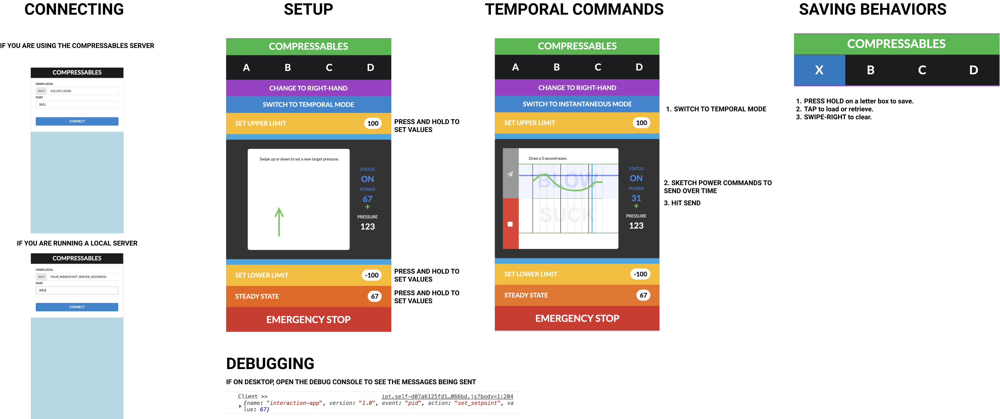

# Compressables Design Tool
This repository contains the design tool source code for [Compressables](https://github.com/The-Hybrid-Atelier/Compressables-Prototyping-Toolkit).

## Maintainers
* Shreyosi Endow
* Cesar Torres

## Design Tool
* [Online Tool](http://compressables.cearto.com/)

## Getting Started


### Running the App (Cloud)
Please note that data is not encrypted or protected when using our cloud server. This app is available for development purposes only. You can download and run the app on your local computer (instruction below) to restrict access to your local area network.

Use SERVER_IP = XXX.XXX.XX.XX when configuring your Fruit.ino code below.

To use the app (online), simply point your browser to:
http://compressables.cearto.com/

### Running the Server Locally (Optional)
On your local machine, download and install ruby-2.6.3 using rvm. 

Install the following gems in your CLI. 
```
gem install em-websocket
```
Run the server:
```
# specify a port  (default: 3001)
rb server.rb -p 3001
>> Server can be accessed using ws://<YYY.YYY.YY.YYY>:<PORT>
```
Use the IP address (YYY.YYY.YY.YYY) that is printed in your terminal.
To use the app (locally), navigate to the rails-app folder.
```
# install packages
bundle install
# run the app
rails s
```
Point your browser to:
http://localhost:3000


## Contributing
The material available through this repository is open-source under the MIT License. We welcome contributions of community-made designs! You can either submit a pull request via Github or send us a link to your Instructables, Thingiverse, or design files to anonymized.


